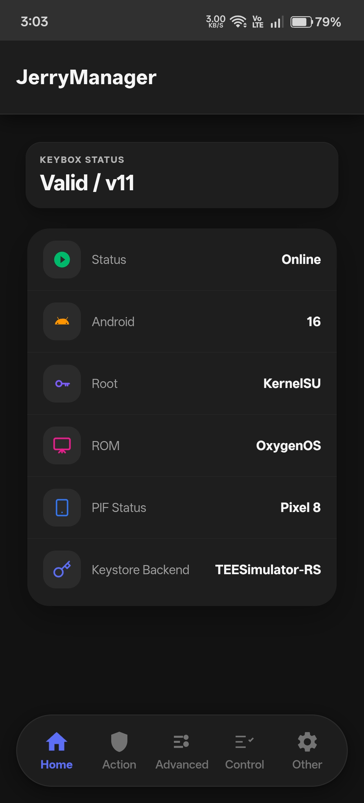
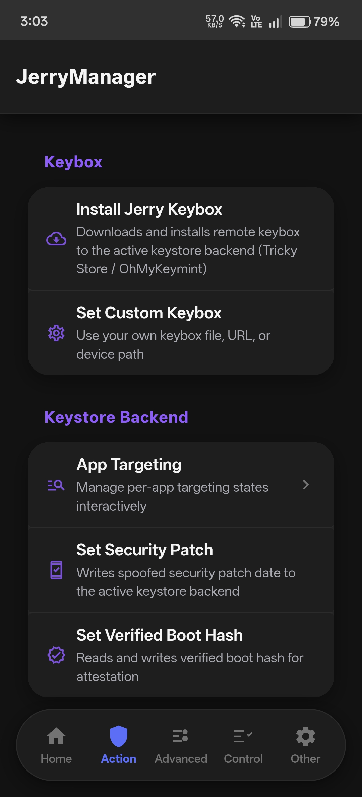
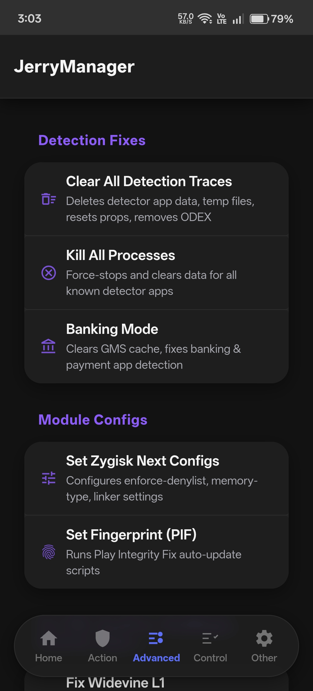
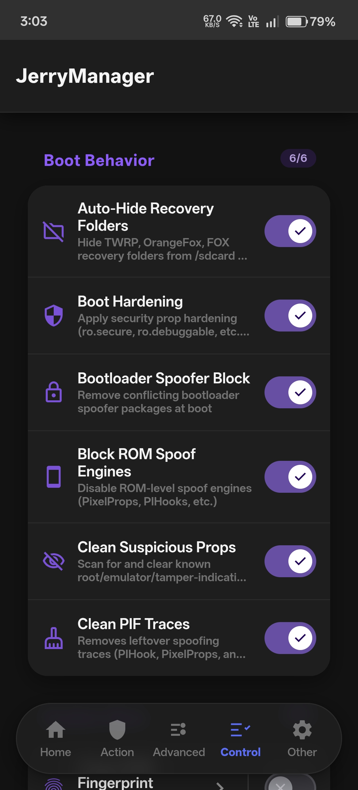
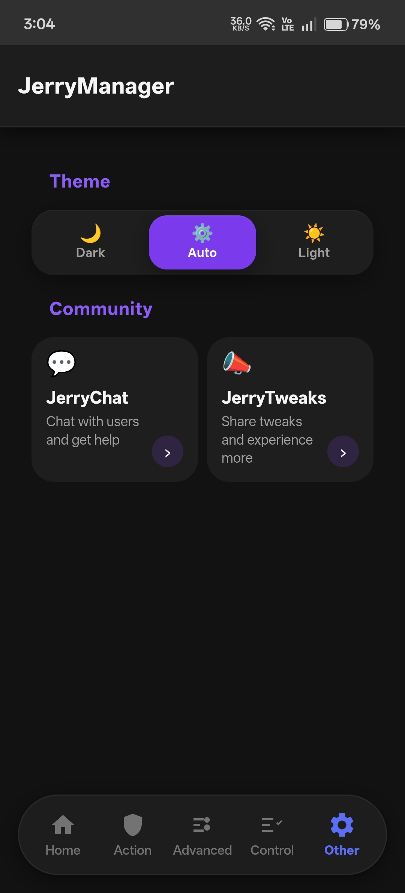

<div align="center">

# JerryManager

**A KernelSU / APatch module for achieving and maintaining Root Hiding and Integrity on Android.**

[](https://github.com/WajahatNaeem056/JerryManager)
[](https://github.com/WajahatNaeem056/JerryManager/releases/latest)

[](LICENSE)
[](https://github.com/WajahatNaeem056/JerryManager/commits/main)

</div>

---

## About

**JerryManager** is a root module for KernelSU and APatch focused on one job: getting devices to pass **Basic**, **Device**, and **Strong** Play Integrity checks, and keeping them passing across reboots and updates. It ships with a full Web UI for configuration instead of raw config files.

Built for people who need integrity to actually hold — banking apps, payment systems, and other attestation-sensitive apps that break the moment a device is flagged.

## Features

- **Play Integrity And Root Hiding** — full pipeline covering keybox injection, security patch spoofing, and prop hardening to pass Strong Integrity
- **Keybox Management** — install the bundled Jerry keybox or supply your own (file, URL, or device path)
- **Keystore Backend Support** — TrickyStore, OhMyKeymint, and TEESimulator-RS
- **App Targeting** — manage per-app targeting states interactively, with Auto Target (inotify + polling) for new installs
- **Security Patch & Verified Boot Hash Spoofing** — writes spoofed values to the active keystore backend
- **Detection Fixes** — clear detection traces, kill known detector processes, and a dedicated Banking Mode for banking/payment app checks
- **Module Configs** — Zygisk Next configuration and Play Integrity Fix (PIF) auto-update
- **Custom ROM Handling** — clean ROM fingerprint, LineageOS identity cleanup, and custom ROM identity cleanup
- **Boot Behavior Controls** — auto-hide recovery folders, boot hardening, bootloader/ROM spoof-engine blocking, and PIF trace cleanup on every boot
- **ADB & Debug Disabler** — hide developer options, USB debugging, and OEM unlock support
- **Widevine L1** — attestation keys via KmInstallKeybox
- **ROM Detection** — identifies the running ROM using verified filesystem markers rather than guessing from spoofable build props; unknown ROMs are reported as `Unknown` instead of a wrong guess
- **Web UI** — Material Design 3 interface (Home, Action, Advanced, Control, Other tabs) with Dark/Light/Auto theming; no manual file editing required

## Screenshots

<div align="center">





</div>

*(Home, Action, Advanced, Control, Other)*

## Installation

1. Download the latest ZIP from [Releases](https://github.com/WajahatNaeem056/JerryManager/releases/latest)
2. Flash via KernelSU, APatch, or Magisk
3. Reboot
4. Open the module's Web UI from your manager app to configure

## Building from source

The WebUI's Material Web components are built with Vite. This step is only needed if you're modifying the UI — the module works as-is without rebuilding.

```bash
git clone https://github.com/WajahatNaeem056/JerryManager
cd JerryManager
npm install
npm run build
```

This outputs into `Jerry/webroot/assets/`, alongside the module's own hand-written scripts (`app-core.js`, `module-configs.js`, etc.), which are plain JS and need no build step.

## Testing

```bash
bash tests/run.sh
```

Runs the full shell test suite — file/structure checks, hardcoded-path detection, and `module.prop` version-sync verification. This also runs automatically in CI on every push and pull request.

## Requirements

- KernelSU, APatch, or Magisk
- Android 8.0+

## Contributing

Bug reports, feature requests, and pull requests are welcome. See [CONTRIBUTING.md](CONTRIBUTING.md) for setup, PR guidelines, and code style.

## Developer

**WajahatNaeem056**

- GitHub: [@WajahatNaeem056](https://github.com/WajahatNaeem056)
- Telegram: [@JerryChatt](https://t.me/JerryChatt)
- Telegram: [@JerryTweaks](https://t.me/JerryTweaks)

## License

GPL-3.0 — see [LICENSE](LICENSE) for full terms.

---

<div align="center">

*Built for the community, by the community.*

</div>
